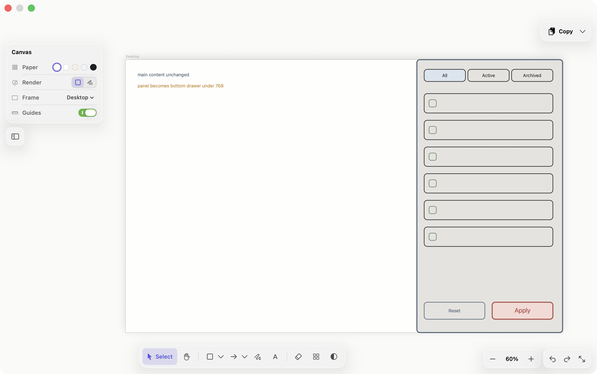
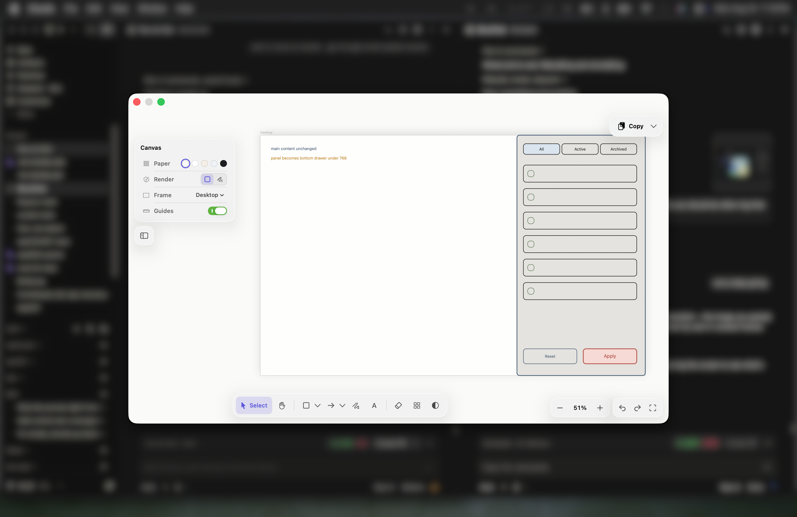
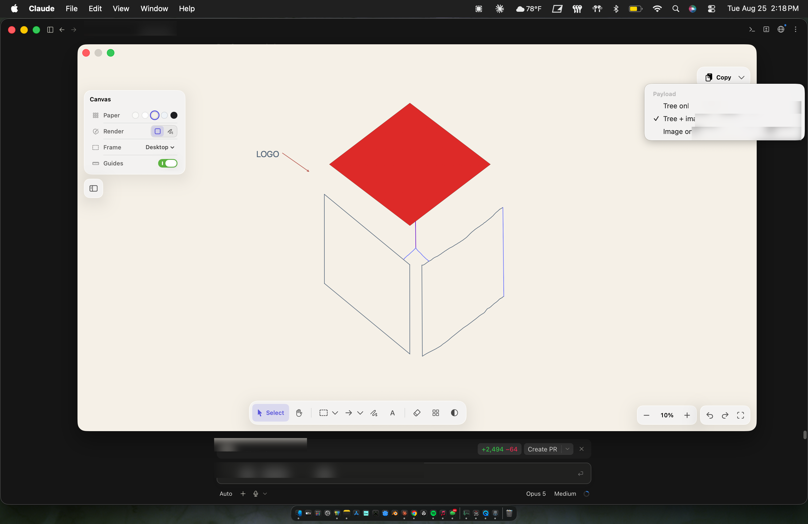
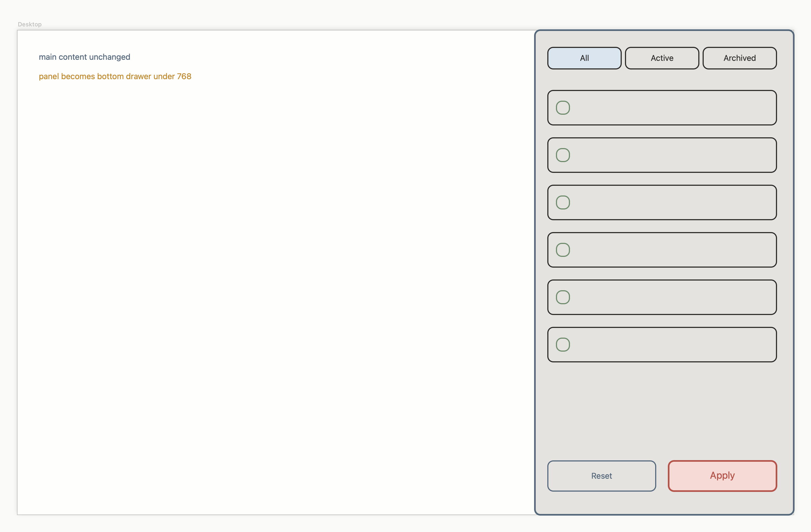

<div align="center">
<picture>
  <source media="(prefers-color-scheme: dark)" srcset="docs/logo/logo-dark-512.png">
  
</picture>

# Blockpad

**A macOS sketchpad that opens on a hotkey and hands drawings to whatever coding agent you're in.**

[](LICENSE)




</div>

---

## Why this exists

Figma and Excalidraw are good tools. They are also another tab, another context,
a lot of clicks, and an account you have to keep — and the genuinely useful tiers
cost money. None of that is wrong for design work. It is all wrong for the ninety
seconds where you just need to say *where the boxes go*.

Because that is usually the whole problem. You are in a repo, working with an
agent, and you need to say *"filters go in a right-side panel, tabs across the
top, reset and apply in the footer."* You type it. The agent builds something
reasonable and wrong. You correct it. Closer, still wrong. Three rounds later you
have spent real tokens, real minutes, and real attention reading implementations
you are about to throw away.

The cost is not the message. It is the **rounds**.

Blockpad is one hotkey and one canvas. `Ctrl+Opt+B`, drag four boxes,
`Cmd+Return`, paste. No model inside it, no account, no subscription, nothing
agent-initiated, and it never leaves your machine. It is a faster input device
for one specific moment, and the constraint is the product.

<div align="center">

<br>
<sub>It opens over whatever you are already in. The session behind is blurred; the sketch is not.</sub>
</div>

<div align="center">

<br>
<sub>Blockpad's own mark, blocked out in Blockpad. Redacted regions are the
host session's repo and prompt, not part of the app.</sub>
</div>

Two things follow, and they are the point:

**It reduces the cost of being understood.** The sketch becomes an exact scene
tree *locally*, with no inference — coordinates, counts and nesting are stated
rather than guessed from a picture. Numbers below.

**It makes design legible to people who are not designers.** Anyone who can drag
a rectangle can specify an interface well enough for an agent to build it. For
internal tools — the ones nobody staffs a designer on — that is most of the
value.

Loop target: **six seconds, no mouse travel outside the canvas.**

---

## Where this came from

I ran design at a startup, and spent most of that stretch building with agentic
tools — writing code to produce design rather than the other way round.

What I kept noticing was my own workaround. Any time I needed an agent to
actually understand a layout, I would sketch a rough wireframe and screenshot it.
Not because the screenshot was good. Because it carried my intent in a way a
paragraph never did. It was the fastest way to point at what I meant, so I did it
constantly, in whatever tool happened to be open.

The screenshot was always the wrong artifact, though. It hands over a *picture*
of a structure and asks the model to work backwards into the structure again —
which it sometimes gets right and sometimes doesn't, and either way you pay for
the guess. What was in my head was never pixels. It was "panel on the right, six
rows, two buttons in the footer."

Blockpad is that workaround turned into a tool. Same rough wireframe, same ninety
seconds — except it hands over the structure directly instead of a photograph of
it, and it opens on a keystroke without taking me out of the repo I am already
in.

---

## What it sends

Blocks are typed, so the scene graph serializes to text locally. No inference,
no model, no API call.



The sketch above becomes this:

```
Frame 1440x900  @0,0  "Desktop"
  Box 480x900  @960,0  @right-full-height  stroke #55677A  fill #E5E3DF
    Box 136x40  @24,32  @left-top  "All"  fill #DAE5EF
    Box 136x40  @168,32  @top  "Active"
    Box 136x40  @312,32  @top  "Archived"
    Box 424x64  ×6  @24,112  step 0,88  @left
      Box 24x24  @16,20  @left  stroke #6E8B6A
    Box 200x56  @24,800  @left-bottom  "Reset"  stroke #55677A
    Box 200x56  @248,800  @bottom  "Apply"  stroke #B4534A  fill #F6DAD5
  Text  @40,40  @left-top  "main content unchanged"  stroke #55677A
  Text  @40,76  @left  "panel becomes bottom drawer under 768"  stroke #C08A2E
```

Every block carries an offset from its parent, so the layout reconstructs
exactly rather than approximately. Colours are hex, not names — `#55677A` is a
value the receiving agent can paste into CSS, where `[slate]` would have been a
lookup it could not perform. Repeats collapse to a count plus the step between
them, so `×6` stays cheap without discarding where the other five are.

On that exact scene:

| Mode | Cost | Use |
|---|---|---|
| **Tree only** | **617 characters** | Default. Structural changes, layout specs. |
| Image only | **2,153 tokens** | When proportion or feel matters. |
| Tree + image | both | Annotated screenshots, where the tree alone is thin. |

The image figure is arithmetic and exact: Anthropic resizes anything over
1568px on the long edge, then charges `(width × height) / 750`. The sample
renders at 3008×1976, which becomes 1568×1030, which is 2,153 tokens.

The tree figure is deliberately given in characters rather than tokens, because
**tokens are the thing you cannot estimate honestly.** Character-count
heuristics and OpenAI tokenizers both misjudge Claude, and they misjudge it
worst on exactly this kind of text — `@960,0`, `#55677A`, `×6` tokenize far
less kindly than prose. 617 characters is somewhere in the low hundreds of
tokens; pinning it down takes a measurement, not a ratio.

So run the measurement rather than trusting a number in a README:

```bash
ANTHROPIC_API_KEY=... ./Scripts/measure-payload.sh
```

It counts the tree through Anthropic's `count_tokens` endpoint, computes the
image side from the dimensions, and prints the table. The image half runs
without a key.

What survives without any measurement is the shape of the gap: a screenshot of
this sketch costs over two thousand tokens, and the tree is 617 characters of
plain text. That is roughly an order of magnitude, and it holds across any
plausible tokenization. It is also structurally *more* precise — six identical
rows collapse to `×6` with an exact count and an exact step, rather than a
model counting rectangles in a JPEG and getting five.

Being honest about the other half: **an image is not automatically the expensive
choice.** One 2,000-token picture that lands the layout first time beats four
rounds of prose plus four implementations you have to read and reject. The tree
is the default because it is cheap *and* precise, but the mode switcher is right
next to the copy button for the times feel matters more than structure.

---

## Using it

Runs as a menu bar item with no dock icon. Two hotkeys toggle the canvas:
`Ctrl+Opt+B` and `Ctrl+Opt+Space`.

> **Heads up on `Ctrl+Opt+Space`.** macOS ships that chord bound to "Select next
> source in Input menu", and a system binding beats an app's. On a clean machine
> it will do nothing. Either use `Ctrl+Opt+B`, which nothing else claims, or
> clear the system one in System Settings → Keyboard → Keyboard Shortcuts →
> Input Sources.

The window **persists, it does not dismiss.** UI iteration is iterative: you
send a sketch, the agent builds it, it is 70% right, you nudge two blocks and
send again. If the canvas cleared on send you would redraw every round. So the
hotkey toggles rather than summons, contents survive hide/show and restart, the
window remembers its size and position, `Esc` hides without discarding, and
clearing is explicit.

### Tools

| | |
|---|---|
| `1`–`0` | tools, left to right along the dock |
| `V` `H` `F` `R` `O` `D` `A` `L` `P` `T` `E` | select, pan, frame, rect, ellipse, diamond, arrow, line, draw, text, eraser |
| padlock | keeps a tool active; off, it reverts to select after one shape |

Shapes and connectors each collapse into one dock slot holding whichever member
you used last, with the rest on a flyout.

### Canvas

| | |
|---|---|
| `Cmd+Return` | copy payload |
| `Cmd+Z` / `Shift+Cmd+Z` | undo / redo |
| `Cmd+X` / `Cmd+C` / `Cmd+V` | cut · copy · paste, on the canvas |
| `Cmd+G` / `Shift+Cmd+G` | group · ungroup |
| `Cmd+D` | duplicate · `Cmd+A` select all |
| `Cmd+[` / `Cmd+]` | send backward / bring forward (`Shift` for all the way) |
| `Cmd+0` / `Cmd+9` | zoom 100% / centre on the drawing |
| `Cmd+Backspace` | clear canvas |
| double-click | edit text, or start a text block on empty canvas |
| space-drag, scroll | pan · `Ctrl`- or `Cmd`-scroll or pinch zooms |
| drag with guides on | edges and centres snap to nearby blocks |
| `Shift`-drag a connector | snaps its heading to 15° |
| drag a connector's mid-handle | bows it off its chord |
| drag the round handle above a shape | rotates it · `Shift` snaps to 15° |
| viewfinder button | fits the drawing into the area the chrome is not covering |

**Alignment guides** are worth calling out. Grid snapping gives tidy coordinates
but not tidy layouts — two boxes can both sit on the grid and still look a step
out. Dragging solves the three interesting lines per axis against every other
block, pulls to the nearest match, and draws a guide across the objects that
share it. Multi-selection moves as a rigid body so its internal spacing cannot
drift.

### Connectors

Arrows and lines point anywhere — the heading is free, `Shift` snaps it to 15°,
and a round mid-handle bows the line into a curve with the arrowhead following
the tangent. The inspector carries the same two as numbers you can scrub. Both
reach the payload: a connector serializes as its length, its heading in degrees,
and its bow, rather than as a bounding box that says nothing about which way it
runs.

### Planes

A shape can be tilted onto a plane — the three isometric faces as presets, or
free rotation and skew. A rotation handle sits above the block; `Shift` snaps it
to 15°. Text, fills, corner radii and hit testing all follow the tilt, and the
selection outline traces the tilted shape rather than a box around it.

The tilt is **affine**, not a free quadrilateral, and that is a payload decision
rather than an implementation shortcut. An affine transform maps one-to-one onto
a CSS `transform`, so what reaches the agent is something it can paste; an
arbitrary quad is a projective transform it could only approximate. It also
means a rect stays a rect, so alignment, snapping and run detection keep working
— none of which have an answer for the left edge of an arbitrary quad.

In the tree a tilt names itself: `Box 200x200 @40,60 iso-top`. An agent that
ignores it still has a correct flat layout, which is the right failure mode —
the plane is presentation, the rect is structure.

### Grouping

`Cmd+G` binds a selection together: clicking any member takes the whole group,
and it moves as one. Grouping is a decision you made, so it is stored
separately from the geometric nesting the tree infers, and it survives you
dragging the pieces apart.

### Templates

Four templates set the defaults for what you draw next — Modern Minimal,
Accessible, Storyboard, User Story. They never restyle what is already on the
canvas; that is not a default, it is damage.

**Accessible is the one that does more than look different.** It carries rules
rather than preferences — WCAG AA contrast at 4.5:1, 44pt minimum targets, 16pt
minimum text — and checks the drawing against them as you work. Blocks that
break one get a small amber dot, not a red outline: a sketch is provisional by
definition, and a wall of errors over a rough layout is hostile. The inspector
shows a live count and selects the offenders.

It is also the only template that names itself in the payload:

```
template accessible  # WCAG AA contrast, 44pt targets, 16pt text
Box 200x48  @0,70  "Submit"  stroke #14181F  fill #FFFFFF  r8
```

That line costs almost nothing and changes how everything under it should be
read. An agent told `accessible` should not offer a 3:1 grey. The templates that
only set defaults stay silent, because their effect is already in the hex values
the tree carries anyway.

The contrast check uses real WCAG relative luminance, with the sRGB gamma
expansion — not a brightness average, which is wrong across the whole midrange,
exactly where people pick colours. It is tested against the published boundary:
`#767676` on white clears 4.5:1 at 4.54, `#777777` does not.

### Styling

Colour is arbitrary hex, not a fixed palette. Four presets stay inline in each
row for the common case; the swatch opens RGB channel sliders with live gradient
tracks, a hex field, the colours you reached for recently, the full preset set,
and the system picker. Stroke width and corner radius are real numbers you can
step, type, or drag to scrub. All of it lands in the tree as values the
receiving agent can act on.

---

## Building

```bash
./Scripts/bundle.sh release
open build/Blockpad.app
```

Requires Swift 6 and macOS 14+. Dependencies are `KeyboardShortcuts` and
nothing else yet.

> Launching the bundle from inside `~/Desktop`, `~/Documents`, or `~/Downloads`
> makes macOS prompt for folder access. Blockpad only writes to
> `~/Library/Application Support/Blockpad`, so "Don't Allow" is the right answer
> — or move the `.app` somewhere neutral.

Other entry points:

```bash
./Scripts/icon.sh                              # regenerate the icon from code
.build/debug/Blockpad --render-sample ./out    # render the example scene + tree
.build/debug/Blockpad --seed-demo              # load the example into the app
```

The icon is drawn in Core Graphics rather than stored as an asset, so it cannot
drift from the palette.

---

## State of play

**M0 is done**, and the app has moved a long way past it.

Shapes are frame, rectangle, ellipse, diamond, arrow, line, freehand and text,
with arbitrary hex colour on stroke and fill, numeric stroke width and corner
radius, fill patterns, opacity and layer order. Alignment guides pull edges and
centres to nearby blocks while you drag. A component drawer carries thirty-two
blockouts across Layout, Controls, Data and Feedback — all of which land as
plain blocks, because the tree stays the only contract.

The design departed from the original plan three times, deliberately:

- **Crisp, not hand-drawn.** §4 argued roughness signals *provisional* and stops
  a model reading proportions as exact. That risk turned out to be covered
  elsewhere — the tree states coordinates and counts outright — so the default is
  clean geometry. The sketch renderer is one toggle away.
- **A dock, not a top bar.** The top edge of a drawing is where you look. Tools
  live along the bottom; the inspector is a collapsible rail of rows.
- **Arbitrary colour.** §3 said five swatches and no picker, and §11 listed a
  colour picker as a non-goal. Both reversed. The payload got better for it: hex
  is actionable where a palette name was not.

**Next is M1: delivery.** Today Blockpad copies and you paste. M1 captures the
frontmost app before the panel takes focus and pastes into it directly — text
everywhere, images into editors, and a written-to-disk path for terminals, which
is what makes CLI agents work at all. The plan is in
[docs/superpowers/plans](docs/superpowers/plans/2026-08-21-m1-delivery.md); the
pure-logic half is built and tested, the paste itself is not yet wired.

See [PLAN.md](PLAN.md) for the full design, the open questions, and the
reasoning behind each decision.

---

## Non-goals

Not a design tool. No layers panel, no Figma export, no collaboration, no
cloud, no account, no LLM inside the app, and no Windows until the Mac version
is actually good.

<sub>The colour picker used to be on this list. It is not any more — see State of
play.</sub>

---

<sub>Built by <a href="https://ubik.studio">Ubik Studio</a>.</sub>
